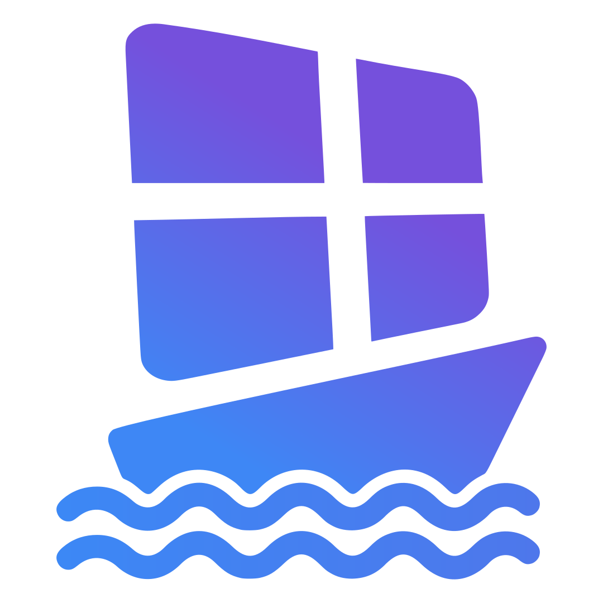
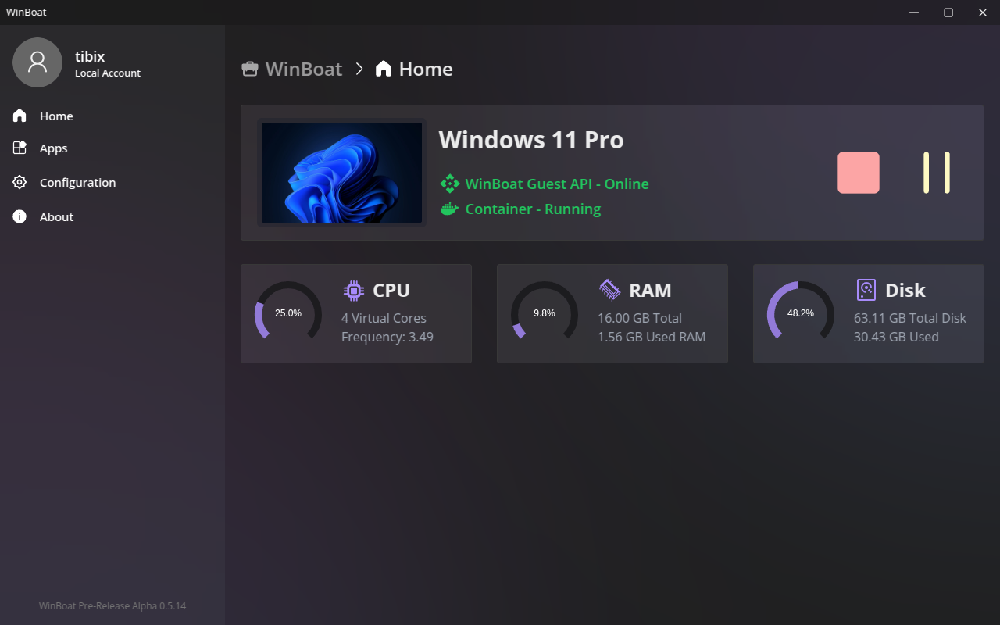
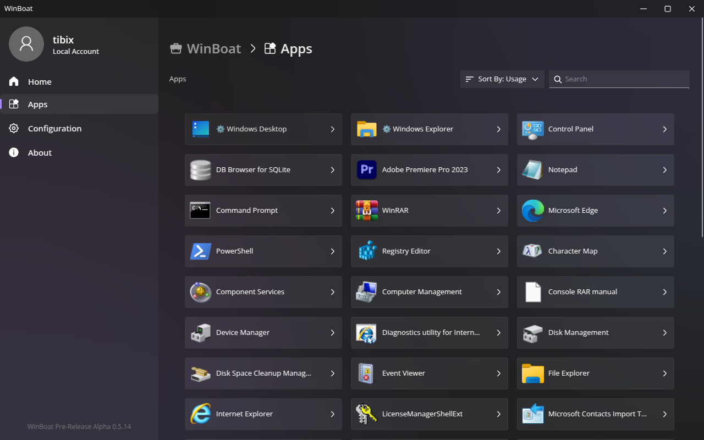
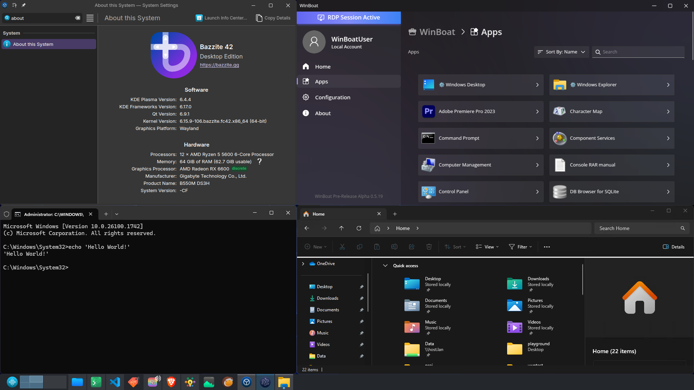

<div align="left">
  <table>
    <tr>
      <td>
        
      </td>
      <td>
        <h1 style="color: #7C86FF; margin: 0; font-size: 32px;">WinBoat</h1>
        <p style="color: oklch(90% 0 0); font-size: 14px; margin: 5px 0;">Windows for Penguins.<br>
        Run Windows apps on 🐧 Linux with ✨ seamless integration</p>
      </td>
    </tr>
  </table>
</div>

## Screenshots

<div align="center">
  
  
  
</div>

## ⚠️ Work in Progress ⚠️

WinBoat is currently in beta, so expect to occasionally run into hiccups and bugs. You should be comfortable with some level of troubleshooting if you decide to try it, however we encourage you to give it a shot anyway.

## ARM64 / Asahi Linux port status

This branch extends WinBoat to native ARM64 Linux hosts. It keeps the upstream
x86_64 path and adds architecture checks, ARM64 packaging, automatic Windows
ARM media policy, and a small container-side userspace forwarder for rootless
Podman networks.

Validated in the exact-commit ARM64 CI build on `ubuntu-24.04-arm`:

- native ARM64 Electron packages and bundled ARM64 forwarding helper;
- architecture and rootless forwarding lifecycle tests; and
- Podman fail-closed checks that reject an x86_64 container image or
  unverifiable custom Windows media on an ARM64 host.

The ARM64 CI artifact from implementation commit `abfbcc1` was smoke-tested on
Fedora Asahi Remix. The native AppImage UI, KVM-backed Windows ARM VM, rootless
Podman forwarding recovery, noVNC, Guest API, and RDP TCP/UDP forwarding all
passed while the existing container remained running with zero restarts.

The automatic media path installs Windows on ARM. Existing x86/x64 Windows
applications then depend on Windows on ARM's own compatibility layer. The
bundled WinBoat Guest Server is still built for Windows amd64 and likewise
depends on that compatibility layer. Custom ISO media is intentionally rejected
on ARM64 until its architecture can be verified safely.

The Docker path has architecture-preflight test coverage but no live ARM64
sign-off. Rootless Podman has the Fedora Asahi Remix sign-off described above.
GPU passthrough, Podman USB passthrough, and arbitrary x86 kernel drivers are
not provided by this port.

## Features

- **🎨 Elegant Interface**: Sleek and intuitive interface that seamlessly integrates Windows into your Linux desktop environment, making it feel like a native experience
- **📦 Automated Installs**: Simple installation process through our interface - pick your preferences & specs and let us handle the rest
- **🚀 Run Any App**: If it runs on Windows, it can run on WinBoat. Enjoy the full range of Windows applications as native OS-level windows in your Linux environment
- **🖥️ Full Windows Desktop**: Access the complete Windows desktop experience when you need it, or run individual apps seamlessly integrated into your Linux workflow
- **📁 Filesystem Integration**: Your home directory is mounted in Windows, allowing easy file sharing between the two systems without any hassle
- **✨ And many more**: Smartcard passthrough, resource monitoring, and more features being added regularly

## How Does It Work?

WinBoat is an Electron app which allows you to run Windows apps on Linux using a containerized approach. Windows runs as a VM inside a Docker/Podman container, we communicate with it using the [WinBoat Guest Server](https://github.com/TibixDev/winboat/tree/main/guest_server) to retrieve data we need from Windows. For compositing applications as native OS-level windows, we use FreeRDP together with Windows's RemoteApp protocol.

## Prerequisites

Before running WinBoat, ensure your system meets the following requirements:

- **RAM**: At least 4 GB of RAM
- **CPU**: At least 2 CPU threads
- **Storage**: At least 32 GB free space on the drive your selected install folder corresponds to
- **Virtualization**: KVM enabled in BIOS/UEFI
    - [How to enable virtualization](https://duckduckgo.com/?t=h_&q=how+to+enable+virtualization+in+%3Cmotherboard+brand%3E+bios&ia=web)
- **In case of Docker:**
  - **Docker**: Required for containerization
      - [Installation Guide](https://docs.docker.com/engine/install/)
      - **⚠️ NOTE:** Docker Desktop is **not** supported, you will run into issues if you use it
  - **Docker Compose v2**: Required for compatibility with docker-compose.yml files
      - [Installation Guide](https://docs.docker.com/compose/install/#plugin-linux-only)
  - **Docker User Group**: Add your user to the `docker` group
      - [Setup Instructions](https://docs.docker.com/engine/install/linux-postinstall/#manage-docker-as-a-non-root-user)
- **In case of Podman:**
  - **Podman**: Required for containerization
      - [Installation Guide](https://podman.io/docs/installation#installing-on-linux)
      - On Debian/Ubuntu and forks, the Podman version installed with `apt install` could be too old. Make sure you have **Version 4.x.x** or higher to ensure the installation completes successfully.
  - **Podman Compose**: Required for compatibility with podman-compose.yml files
      - [Installation Guide](https://github.com/containers/podman-compose?tab=readme-ov-file#installation)
- **FreeRDP**: Required for remote desktop connection (Please make sure you have **Version 3.x.x** with sound support included)
    - [Installation Guide](https://github.com/FreeRDP/FreeRDP/wiki/PreBuilds)
- [OPTIONAL] **Kernel Modules**: The `iptables` / `nftables` kernel modules can be loaded for better network performance, but this is not obligatory in newer versions of WinBoat
    - [Module loading instructions](https://rentry.org/rmfq2e5e)

## Downloading

You can download the latest Linux builds under the [Releases](https://github.com/TibixDev/winboat/releases) tab. We currently offer four variants:

- **AppImage:** A popular & portable app format which should run fine on most distributions
- **Unpacked:** The raw unpacked files, simply run the executable (`linux-unpacked/winboat`)
- **.deb:** The intended format for Debian based distributions
- **.rpm:** The intended format for Fedora based distributions
- **Nix (Nixpkgs)**
    1. Add the winboat package to your config (ensure using nixpkgs-unstable)
    using `environment.systemPackages = [pkgs.winboat];` or `home.packages = [pkgs.winboat];` if using home manager.
    2. Add the following lines to your nix configuration
    ```nix
    virtualisation.docker.enable = true;
    users.users.{yourUser}.extraGroups = ["docker"];
    ```
## Known Issues About Container Runtimes

- Docker Desktop is **unsupported** for now
- USB passthrough via Podman is currently **unsupported**

## Building WinBoat

- For building you need to have Bun and Go installed on your system
- Clone the repo (`git clone https://github.com/TibixDev/WinBoat`)
- Install the dependencies (`bun i`)
- Run the release gate (`bun run verify`)
- Build the app and the guest server using `bun run build:linux-gs`
- You can now find AppImage, DEB, RPM, tar.bz2, and unpacked outputs under `dist`

Linux package builds also need the native USB/udev headers and FPM's legacy
crypt compatibility library. On Debian/Ubuntu install `libcrypt1`,
`libudev-dev`, and `libusb-1.0-0-dev`; on Fedora install
`libxcrypt-compat`, `systemd-devel`, and `libusb1-devel`.

On ARM64, build natively on an ARM64 Linux host (or the ARM64 GitHub-hosted
runner used by this branch). The package includes both ARM64 and amd64 variants
of the rootless port-forward helper so the same source tree still builds on
x86_64.

## Running WinBoat in development mode

- Make sure you meet the [prerequisites](#prerequisites)
- Additionally, for development you need to have Bun and Go installed on your system
- Clone the repo (`git clone https://github.com/TibixDev/WinBoat`)
- Install the dependencies (`bun i`)
- Build the guest server (`bun run build:gs`)
- Run the app (`bun run dev`)

## Contributing

Contributions are welcome! Whether it's bug fixes, feature improvements, or documentation updates, we appreciate your help making WinBoat better.

**Please note**: We maintain a focus on technical contributions only. Pull requests containing political/sexual content, or other sensitive/controversial topics will not be accepted. Let's keep things focused on making great software! 🚀

Feel free to:

- Report bugs and issues
- Submit feature requests
- Contribute code improvements
- Help with documentation
- Share feedback and suggestions

Check out our issues page to get started, or feel free to open a new issue if you've found something that needs attention.

## License

WinBoat is licensed under the [MIT](https://github.com/TibixDev/winboat/blob/main/LICENSE) license

## Inspiration / Alternatives

These past few years some cool projects have surfaced with similar concepts, some of which we've also taken inspirations from.\
They're awesome and you should check them out:

- [WinApps](https://github.com/winapps-org/winapps)
- [Cassowary](https://github.com/casualsnek/cassowary)
- [dockur/windows](https://github.com/dockur/windows) (🌟 Also used in WinBoat)

## Socials & Contact

- [](https://www.winboat.app/)
- [](https://x.com/winboat_app)
- [](https://fosstodon.org/@winboat)
- [](http://bsky.app/profile/winboat.app)
- [](http://discord.gg/MEwmpWm4tN)
- [](mailto:staff@winboat.app)
- [](https://deepwiki.com/TibixDev/winboat)

## Star History

<a href="https://www.star-history.com/?repos=tibixdev%2Fwinboat&type=date&legend=top-left">
 <picture>
   <source media="(prefers-color-scheme: dark)" srcset="https://api.star-history.com/chart?repos=tibixdev/winboat&type=date&theme=dark&legend=top-left&sealed_token=zAULDxizn0P-jCXSLfkaIJCa-OhtmdFRKaZ3CfYqpk2L4um_02jxxY0_CVY_IrvpAJk8hph0kK0oyrlD0exFSrs4VDF86zOvTw3K0FVjggjuVR_v2gre9koLhhy8vTSR3UrY1xcINMWrbDurLh9Uiej8ZD2tsDDeksYZKnJMtaDSDp0zh2zJDGGrXBx4" />
   <source media="(prefers-color-scheme: light)" srcset="https://api.star-history.com/chart?repos=tibixdev/winboat&type=date&legend=top-left&sealed_token=zAULDxizn0P-jCXSLfkaIJCa-OhtmdFRKaZ3CfYqpk2L4um_02jxxY0_CVY_IrvpAJk8hph0kK0oyrlD0exFSrs4VDF86zOvTw3K0FVjggjuVR_v2gre9koLhhy8vTSR3UrY1xcINMWrbDurLh9Uiej8ZD2tsDDeksYZKnJMtaDSDp0zh2zJDGGrXBx4" />
   
 </picture>
</a>
